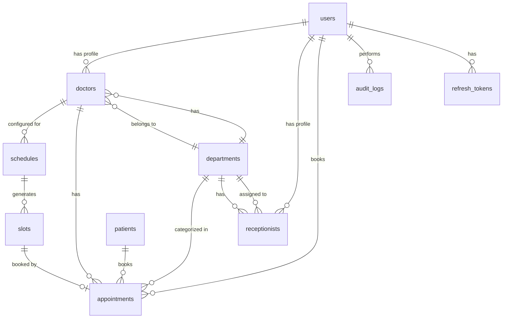

# Database Design - EMR Appointment Management System

## Overview
This document outlines the complete MongoDB database schema design for the EMR Appointment Management System, including collections, relationships, indexes, and optimization strategies.

---

## Collections Overview

```
┌─────────────────────────────────────────────────────────────────────────────┐
│                           DATABASE RELATIONSHIP MAP                         │
├─────────────────────────────────────────────────────────────────────────────┤
│                                                                             │
│  ┌──────────┐      ┌──────────────┐      ┌──────────────┐                 │
│  │  users   │──────│   doctors    │──────│    schedules  │                 │
│  └──────────┘      └──────────────┘      └──────────────┘                 │
│       │                                            │                        │
│       │ (role: doctor/receptionist)               │                        │
│       │                                            │                        │
│       ▼                                            ▼                        │
│  ┌──────────────┐                          ┌──────────┐                   │
│  │  appointments│◄─────────────────────────│  slots   │                   │
│  └──────────────┘                          └──────────┘                   │
│       │                                                                     │
│       │                                                                     │
│  ┌──────────────┐                                                          │
│  │   patients   │                                                          │
│  └──────────────┘                                                          │
│                                                                             │
│  ┌──────────────┐      ┌──────────────┐                                   │
│  │   audits    │      │departments   │                                   │
│  └──────────────┘      └──────────────┘                                   │
└─────────────────────────────────────────────────────────────────────────────┘
```

---

## Collection 1: users

### Purpose
Store authentication credentials and role-based access control information for all system users.

### Schema

```javascript
{
  _id: ObjectId,
  
  // Authentication
  email: {
    type: String,
    required: true,
    unique: true,
    lowercase: true,
    trim: true,
    index: true
  },
  password: {
    type: String,
    required: true,
    bcrypt: true
  },
  
  // Profile
  firstName: {
    type: String,
    required: true,
    trim: true
  },
  lastName: {
    type: String,
    required: true,
    trim: true
  },
  phoneNumber: {
    type: String,
    required: true,
    trim: true
  },
  
  // Role-Based Access Control
  role: {
    type: String,
    enum: ['SUPER_ADMIN', 'RECEPTIONIST', 'DOCTOR'],
    required: true,
    index: true
  },
  
  // Status
  isActive: {
    type: Boolean,
    default: true
  },
  
  // Relationships (polymorphic)
  profileId: {
    type: ObjectId,
    required: function() { 
      return this.role === 'DOCTOR' || this.role === 'RECEPTIONIST' 
    }
  },
  profileType: {
    type: String,
    enum: ['Doctor', 'Receptionist'],
    required: function() { 
      return this.role === 'DOCTOR' || this.role === 'RECEPTIONIST' 
    }
  },
  
  // Metadata
  lastLogin: {
    type: Date
  },
  createdAt: {
    type: Date,
    default: Date.now,
    immutable: true
  },
  updatedAt: {
    type: Date,
    default: Date.now
  },
  
  // Soft delete
  deletedAt: {
    type: Date,
    default: null
  }
}
```

### Indexes

```javascript
// Authentication
{ email: 1 },                    // Unique, for login
{ email: 1, deletedAt: 1 },      // For active user lookup

// RBAC queries
{ role: 1, isActive: 1 },       // For role-based filtering
{ profileId: 1, profileType: 1 } // For profile lookups
```

---

## Collection 2: doctors

### Purpose
Store doctor profile information and department associations.

### Schema

```javascript
{
  _id: ObjectId,
  
  // Basic Information
  userId: {
    type: ObjectId,
    ref: 'users',
    required: true,
    unique: true,
    index: true
  },
  departmentId: {
    type: ObjectId,
    ref: 'departments',
    required: true,
    index: true
  },
  
  // Profile Details
  specialization: {
    type: String,
    required: true,
    trim: true
  },
  qualification: {
    type: String,
    required: true,
    trim: true
  },
  experience: {
    type: Number,  // in years
    min: 0
  },
  
  // Consultation Details
  consultationFee: {
    type: Number,
    required: true,
    min: 0
  },
  consultationDuration: {
    type: Number,  // in minutes, default slot duration
    default: 15,
    min: 5,
    max: 60
  },
  
  // Status
  isActive: {
    type: Boolean,
    default: true
  },
  
  // Metadata
  createdAt: {
    type: Date,
    default: Date.now,
    immutable: true
  },
  updatedAt: {
    type: Date,
    default: Date.now
  },
  createdBy: {
    type: ObjectId,
    ref: 'users'
  },
  deletedAt: {
    type: Date,
    default: null
  }
}
```

### Indexes

```javascript
{ userId: 1 },                    // Unique, for user relationship
{ departmentId: 1, isActive: 1 },  // For department listings
{ isActive: 1 },                  // For active doctor listings
{ specialization: 1 }              // For search (optional)
```

---

## Collection 3: departments

### Purpose
Store department information for categorization and filtering.

### Schema

```javascript
{
  _id: ObjectId,
  
  name: {
    type: String,
    required: true,
    unique: true,
    trim: true,
    index: true
  },
  description: {
    type: String,
    trim: true
  },
  
  // Status
  isActive: {
    type: Boolean,
    default: true
  },
  
  // Metadata
  createdAt: {
    type: Date,
    default: Date.now,
    immutable: true
  },
  updatedAt: {
    type: Date,
    default: Date.now
  },
  deletedAt: {
    type: Date,
    default: null
  }
}
```

### Indexes

```javascript
{ name: 1 },              // Unique
{ isActive: 1 }           // For active listings
```

---

## Collection 4: schedules

### Purpose
Store doctor schedule configurations including working days, sessions, and break timings.

### Schema

```javascript
{
  _id: ObjectId,
  
  doctorId: {
    type: ObjectId,
    ref: 'doctors',
    required: true,
    index: true
  },
  
  // Schedule Configuration
  workingDays: [{
    type: String,
    enum: ['MONDAY', 'TUESDAY', 'WEDNESDAY', 'THURSDAY', 'FRIDAY', 'SATURDAY', 'SUNDAY'],
    required: true
  }],
  
  sessions: [{
    name: {
      type: String,      // "Morning", "Evening"
      required: true
    },
    startTime: {
      type: String,      // "09:00" format
      required: true
    },
    endTime: {
      type: String,      // "12:00" format
      required: true
    }
  }],
  
  breaks: [{
    name: {
      type: String,      // "Lunch Break", "Tea Break"
      required: true
    },
    startTime: {
      type: String,
      required: true
    },
    endTime: {
      type: String,
      required: true
    }
  }],
  
  // Slot Configuration
  slotDuration: {
    type: Number,        // in minutes
    required: true,
    default: 15,
    min: 5,
    max: 120
  },
  
  // Validity Period
  effectiveFrom: {
    type: Date,
    required: true,
    default: Date.now
  },
  effectiveTo: {
    type: Date,
    default: null       // null means indefinite
  },
  
  // Status
  isActive: {
    type: Boolean,
    default: true
  },
  
  // Metadata
  createdAt: {
    type: Date,
    default: Date.now,
    immutable: true
  },
  updatedAt: {
    type: Date,
    default: Date.now
  },
  createdBy: {
    type: ObjectId,
    ref: 'users'
  },
  deletedAt: {
    type: Date,
    default: null
  }
}
```

### Indexes

```javascript
{ doctorId: 1, isActive: 1, effectiveFrom: -1 },  // For active schedule lookup
{ doctorId: 1, effectiveFrom: -1 },                // For schedule history
{ effectiveFrom: 1, effectiveTo: 1 },            // For validity checks
```

---

## Collection 5: slots

### Purpose
Store dynamically generated appointment slots with availability status.

### Schema

```javascript
{
  _id: ObjectId,
  
  doctorId: {
    type: ObjectId,
    ref: 'doctors',
    required: true,
    index: true
  },
  scheduleId: {
    type: ObjectId,
    ref: 'schedules',
    required: true
  },
  
  // Slot Information
  date: {
    type: Date,
    required: true,
    index: true
  },
  startTime: {
    type: String,      // "09:00" format
    required: true
  },
  endTime: {
    type: String,      // "09:15" format
    required: true
  },
  
  // Composite Index for Slot Lookup
  doctorId_date_startTime: {
    type: String       // Composite for unique constraint
  },
  
  // Availability
  isAvailable: {
    type: Boolean,
    default: true,
    index: true
  },
  
  // Appointment Reference
  appointmentId: {
    type: ObjectId,
    ref: 'appointments',
    default: null
  },
  
  // Session Information
  sessionName: {
    type: String      // "Morning", "Evening"
  },
  
  // Metadata
  createdAt: {
    type: Date,
    default: Date.now,
    immutable: true
  },
  updatedAt: {
    type: Date,
    default: Date.now
  }
}
```

### Indexes

```javascript
// CRITICAL: Prevents double booking
{ doctorId: 1, date: 1, startTime: 1 },           // Composite for slot lookup

// Query optimization
{ doctorId: 1, date: 1, isAvailable: 1 },        // For available slots
{ date: 1, isAvailable: 1 },                      // For daily slot listing
{ appointmentId: 1 },                             // For appointment lookup
```

### Unique Constraint

```javascript
// CRITICAL: Ensures no duplicate slots for same doctor, date, and time
{ doctorId: 1, date: 1, startTime: 1 },           // UNIQUE
```

---

## Collection 6: patients

### Purpose
Store patient demographic and contact information.

### Schema

```javascript
{
  _id: ObjectId,
  
  // Patient Information
  patientId: {
    type: String,
    required: true,
    unique: true,
    index: true
  },
  
  firstName: {
    type: String,
    required: true,
    trim: true
  },
  lastName: {
    type: String,
    required: true,
    trim: true
  },
  dateOfBirth: {
    type: Date,
    required: true
  },
  gender: {
    type: String,
    enum: ['MALE', 'FEMALE', 'OTHER'],
    required: true
  },
  
  // Contact Information
  mobileNumber: {
    type: String,
    required: true,
    trim: true,
    index: true
  },
  email: {
    type: String,
    trim: true,
    lowercase: true
  },
  address: {
    street: String,
    city: String,
    state: String,
    postalCode: String,
    country: {
      type: String,
      default: 'India'
    }
  },
  
  // Emergency Contact
  emergencyContact: {
    name: String,
    mobileNumber: String,
    relationship: String
  },
  
  // Medical Information
  bloodGroup: {
    type: String,
    enum: ['A+', 'A-', 'B+', 'B-', 'AB+', 'AB-', 'O+', 'O-']
  },
  allergies: [{
    type: String
  }],
  chronicConditions: [{
    type: String
  }],
  
  // Status
  isActive: {
    type: Boolean,
    default: true
  },
  
  // Metadata
  createdAt: {
    type: Date,
    default: Date.now,
    immutable: true
  },
  updatedAt: {
    type: Date,
    default: Date.now
  },
  deletedAt: {
    type: Date,
    default: null
  }
}
```

### Indexes

```javascript
// Search optimization
{ patientId: 1 },                    // Unique, for patient lookup
{ mobileNumber: 1 },                 // Unique, for mobile search
{ firstName: 1, lastName: 1 },       // For name search
{ isActive: 1 },                     // For active patient filtering

// Composite for search
{ mobileNumber: 1, isActive: 1 },    // For active patient mobile search
{ firstName: 1, lastName: 1, isActive: 1 }  // For active patient name search
```

---

## Collection 7: appointments

### Purpose
Store appointment bookings with patient, doctor, slot relationships and status workflow.

### Schema

```javascript
{
  _id: ObjectId,
  
  // Appointment Number
  appointmentNumber: {
    type: String,
    required: true,
    unique: true,
    index: true
  },
  
  // Relationships
  patientId: {
    type: ObjectId,
    ref: 'patients',
    required: true,
    index: true
  },
  doctorId: {
    type: ObjectId,
    ref: 'doctors',
    required: true,
    index: true
  },
  departmentId: {
    type: ObjectId,
    ref: 'departments',
    required: true,
    index: true
  },
  slotId: {
    type: ObjectId,
    ref: 'slots',
    required: true,
    unique: true,        // CRITICAL: Ensures one appointment per slot
    index: true
  },
  
  // Appointment Details
  date: {
    type: Date,
    required: true,
    index: true
  },
  startTime: {
    type: String,      // "09:00" format
    required: true
  },
  endTime: {
    type: String,      // "09:15" format
    required: true
  },
  
  // Clinical Information
  purpose: {
    type: String,
    required: true,
    trim: true
  },
  notes: {
    type: String,
    trim: true
  },
  consultationNotes: {
    type: String,      // Filled by doctor after consultation
    trim: true
  },
  
  // Status Workflow
  status: {
    type: String,
    enum: ['SCHEDULED', 'ARRIVED', 'COMPLETED', 'CANCELLED'],
    default: 'SCHEDULED',
    required: true,
    index: true
  },
  
  arrivedAt: {
    type: Date,
    default: null
  },
  completedAt: {
    type: Date,
    default: null
  },
  cancelledAt: {
    type: Date,
    default: null
  },
  cancellationReason: {
    type: String,
    default: null
  },
  
  // Booking Metadata
  bookedBy: {
    type: ObjectId,
    ref: 'users',
    required: true
  },
  bookedAt: {
    type: Date,
    required: true,
    default: Date.now
  },
  
  // Last Updated By
  lastUpdatedBy: {
    type: ObjectId,
    ref: 'users'
  },
  
  // Status
  isActive: {
    type: Boolean,
    default: true
  },
  
  // Metadata
  createdAt: {
    type: Date,
    default: Date.now,
    immutable: true
  },
  updatedAt: {
    type: Date,
    default: Date.now
  },
  deletedAt: {
    type: Date,
    default: null
  }
}
```

### Indexes

```javascript
// Primary indexes
{ appointmentNumber: 1 },              // Unique, for appointment lookup
{ slotId: 1 },                         // Unique, CRITICAL for preventing double booking

// Query optimization
{ patientId: 1, date: -1 },            // For patient appointment history
{ doctorId: 1, date: -1 },            // For doctor daily appointments
{ departmentId: 1, date: -1 },        // For department statistics
{ date: -1, status: 1 },              // For daily appointment listing
{ status: 1, date: -1 },              // For status-based filtering
{ bookedBy: 1, date: -1 },            // For receptionist bookings

// Composite indexes for common queries
{ doctorId: 1, date: 1, status: 1 },    // For doctor's appointments by status
{ departmentId: 1, date: 1, status: 1 }, // For department appointment stats
{ patientId: 1, status: 1, date: -1 }, // For patient active appointments
```

---

## Collection 8: refresh_tokens

### Purpose
Store JWT refresh tokens for secure authentication renewal.

### Schema

```javascript
{
  _id: ObjectId,
  
  userId: {
    type: ObjectId,
    ref: 'users',
    required: true,
    index: true
  },
  
  token: {
    type: String,
    required: true,
    unique: true,
    index: true
  },
  
  // Token Metadata
  expiresAt: {
    type: Date,
    required: true
  },
  isRevoked: {
    type: Boolean,
    default: false
  },
  revokedAt: {
    type: Date,
    default: null
  },
  
  // Device Information
  userAgent: {
    type: String
  },
  ipAddress: {
    type: String
  },
  
  // Metadata
  createdAt: {
    type: Date,
    default: Date.now,
    immutable: true
  }
}
```

### Indexes

```javascript
{ token: 1 },                        // Unique, for token lookup
{ userId: 1, isRevoked: 1 },         // For active tokens
{ expiresAt: 1, isRevoked: 1 },     // For cleanup of expired tokens
```

---

## Collection 9: audit_logs

### Purpose
Maintain immutable audit trail of all critical system actions for compliance and accountability.

### Schema

```javascript
{
  _id: ObjectId,
  
  // Action Details
  action: {
    type: String,
    required: true,
    enum: [
      'LOGIN',
      'LOGOUT',
      'APPOINTMENT_CREATED',
      'APPOINTMENT_UPDATED',
      'APPOINTMENT_CANCELLED',
      'APPOINTMENT_ARRIVED',
      'APPOINTMENT_COMPLETED',
      'SCHEDULE_CREATED',
      'SCHEDULE_UPDATED',
      'DOCTOR_CREATED',
      'RECEPTIONIST_CREATED',
      'PATIENT_CREATED'
    ],
    index: true
  },
  
  // Actor Information
  userId: {
    type: ObjectId,
    ref: 'users',
    required: true,
    index: true
  },
  userRole: {
    type: String,
    required: true,
    enum: ['SUPER_ADMIN', 'RECEPTIONIST', 'DOCTOR']
  },
  userName: {
    type: String,
    required: true
  },
  
  // Entity Information
  entityType: {
    type: String,
    required: true,
    enum: ['Appointment', 'Schedule', 'Doctor', 'Patient', 'User', 'Slot']
  },
  entityId: {
    type: ObjectId,
    required: true,
    index: true
  },
  entityDescription: {
    type: String,
    required: true
  },
  
  // Change Details
  changes: {
    type: Object,
    default: null
    // Example: { before: { status: "SCHEDULED" }, after: { status: "CANCELLED" } }
  },
  
  // Request Context
  ipAddress: {
    type: String
  },
  userAgent: {
    type: String
  },
  
  // Metadata
  timestamp: {
    type: Date,
    required: true,
    default: Date.now,
    index: true
  }
}
```

### Indexes

```javascript
// Query optimization
{ userId: 1, timestamp: -1 },         // For user activity history
{ entityType: 1, entityId: 1 },       // For entity audit trail
{ action: 1, timestamp: -1 },        // For action-based filtering
{ timestamp: -1 },                   // For recent activity
{ entityType: 1, timestamp: -1 },     // For entity type activity

// Composite indexes
{ userId: 1, action: 1, timestamp: -1 },  // For user specific actions
{ entityType: 1, entityId: 1, timestamp: -1 }  // For entity specific history
```

---

## Collection 10: receptionists

### Purpose
Store receptionist profile information (optional, can be merged with users if minimal data needed).

### Schema

```javascript
{
  _id: ObjectId,
  
  userId: {
    type: ObjectId,
    ref: 'users',
    required: true,
    unique: true,
    index: true
  },
  
  employeeId: {
    type: String,
    required: true,
    unique: true
  },
  
  departmentId: {
    type: ObjectId,
    ref: 'departments',
    required: true,
    index: true
  },
  
  // Status
  isActive: {
    type: Boolean,
    default: true
  },
  
  // Metadata
  createdAt: {
    type: Date,
    default: Date.now,
    immutable: true
  },
  updatedAt: {
    type: Date,
    default: Date.now
  },
  createdBy: {
    type: ObjectId,
    ref: 'users'
  },
  deletedAt: {
    type: Date,
    default: null
  }
}
```

### Indexes

```javascript
{ userId: 1 },                    // Unique
{ employeeId: 1 },                // Unique
{ departmentId: 1, isActive: 1 } // For department listings
```

---

## Relationship Diagram



---

## Indexing Strategy

### Primary Indexes (Performance Critical)

| Collection | Index | Purpose | Type |
|------------|-------|---------|------|
| users | email: 1 | Authentication | Unique |
| users | role: 1, isActive: 1 | RBAC filtering | Composite |
| doctors | userId: 1 | User relationship | Unique |
| doctors | departmentId: 1, isActive: 1 | Department listing | Composite |
| schedules | doctorId: 1, isActive: 1, effectiveFrom: -1 | Active schedule | Composite |
| slots | doctorId: 1, date: 1, startTime: 1 | Slot lookup | Unique |
| slots | doctorId: 1, date: 1, isAvailable: 1 | Available slots | Composite |
| patients | patientId: 1 | Patient lookup | Unique |
| patients | mobileNumber: 1 | Mobile search | Unique |
| appointments | appointmentNumber: 1 | Appointment lookup | Unique |
| appointments | slotId: 1 | Prevent double booking | Unique |
| appointments | doctorId: 1, date: -1 | Doctor appointments | Composite |
| appointments | patientId: 1, date: -1 | Patient history | Composite |
| refresh_tokens | token: 1 | Token lookup | Unique |
| audit_logs | userId: 1, timestamp: -1 | User activity | Composite |

### Secondary Indexes (Optimization)

| Collection | Index | Purpose |
|------------|-------|---------|
| appointments | status: 1, date: -1 | Status filtering |
| appointments | departmentId: 1, date: -1 | Department stats |
| slots | date: 1, isAvailable: 1 | Daily slot listing |
| audit_logs | action: 1, timestamp: -1 | Action filtering |
| audit_logs | entityType: 1, entityId: 1 | Entity audit trail |

---

## Data Integrity Strategies

### 1. Double Booking Prevention

```javascript
// Strategy 1: Unique Constraint on appointments.slotId
appointments.schema.index({ slotId: 1 }, { unique: true })

// Strategy 2: Atomic Update with findOne
// In service layer:
const session = await mongoose.startSession()
session.startTransaction()

const slot = await Slot.findOne({ _id: slotId, isAvailable: true }).session(session)
if (!slot) {
  await session.abortTransaction()
  throw new Error('Slot not available')
}

const appointment = await Appointment.create([{
  slotId,
  // ... other fields
}], { session })

await Slot.findByIdAndUpdate(slotId, { isAvailable: false }, { session })

await session.commitTransaction()
```

### 2. Patient ID Generation

```javascript
// Auto-increment patient ID
pre('save', async function(next) {
  if (!this.patientId) {
    const count = await Patient.countDocuments({})
    this.patientId = `PAT${String(count + 1).padStart(6, '0')}`
  }
  next()
})
```

### 3. Appointment Number Generation

```javascript
// Format: APP-YYYYMMDD-XXXX
pre('save', async function(next) {
  if (!this.appointmentNumber) {
    const today = new Date().toISOString().split('T')[0].replace(/-/g, '')
    const count = await Appointment.countDocuments({ 
      createdAt: { $gte: new Date().setHours(0,0,0,0) }
    })
    this.appointmentNumber = `APP-${today}-${String(count + 1).padStart(4, '0')}`
  }
  next()
})
```

---

## Query Optimization Patterns

### 1. Doctor's Available Slots

```javascript
// Optimized query using composite index
db.slots.find({
  doctorId: ObjectId("..."),
  date: new Date("2024-01-15"),
  isAvailable: true
}).sort({ startTime: 1 })

// Uses index: { doctorId: 1, date: 1, isAvailable: 1 }
```

### 2. Patient Appointment History

```javascript
// Optimized with pagination
db.appointments.find({
  patientId: ObjectId("..."),
  isActive: true
})
.sort({ date: -1, startTime: -1 })
.skip(0)
.limit(20)

// Uses index: { patientId: 1, date: -1 }
```

### 3. Doctor Daily Appointments

```javascript
// Optimized with status filtering
db.appointments.find({
  doctorId: ObjectId("..."),
  date: new Date("2024-01-15"),
  isActive: true
})
.sort({ startTime: 1 })
.populate('patientId')

// Uses index: { doctorId: 1, date: 1 }
```

---

## Scalability Considerations

### For Millions of Appointments

1. **Sharding Strategy**
   - Shard by date range (monthly/quarterly)
   - Shard key: { date: 1, doctorId: 1 }

2. **Archive Strategy**
   - Move completed appointments older than 1 year to archive collection
   - Keep only active/recent appointments in primary collection

3. **Read Optimization**
   - Implement Redis caching for frequently accessed slots
   - Cache doctor schedules for the day
   - Cache available slots for next 7 days

4. **Write Optimization**
   - Batch insert for slot generation
   - Use bulk operations for audit log cleanup
   - Implement queue for non-critical audit writes

---

## Sample Documents

### User Document
```json
{
  "_id": ObjectId("65a1b2c3d4e5f6g7h8i9j0k"),
  "email": "dr.smith@hospital.com",
  "password": "$2b$10$...",
  "firstName": "John",
  "lastName": "Smith",
  "phoneNumber": "+91 9876543210",
  "role": "DOCTOR",
  "isActive": true,
  "profileId": ObjectId("65a1b2c3d4e5f6g7h8i9j1l"),
  "profileType": "Doctor",
  "lastLogin": ISODate("2024-01-15T09:30:00Z"),
  "createdAt": ISODate("2024-01-01T00:00:00Z"),
  "updatedAt": ISODate("2024-01-15T09:30:00Z")
}
```

### Doctor Document
```json
{
  "_id": ObjectId("65a1b2c3d4e5f6g7h8i9j1l"),
  "userId": ObjectId("65a1b2c3d4e5f6g7h8i9j0k"),
  "departmentId": ObjectId("65a1b2c3d4e5f6g7h8i9j2m"),
  "specialization": "Cardiology",
  "qualification": "MBBS, MD",
  "experience": 15,
  "consultationFee": 500,
  "consultationDuration": 15,
  "isActive": true,
  "createdAt": ISODate("2024-01-01T00:00:00Z"),
  "updatedAt": ISODate("2024-01-01T00:00:00Z"),
  "createdBy": ObjectId("65a1b2c3d4e5f6g7h8i9j0k")
}
```

### Schedule Document
```json
{
  "_id": ObjectId("65a1b2c3d4e5f6g7h8i9j3n"),
  "doctorId": ObjectId("65a1b2c3d4e5f6g7h8i9j1l"),
  "workingDays": ["MONDAY", "TUESDAY", "WEDNESDAY", "THURSDAY", "FRIDAY"],
  "sessions": [
    { "name": "Morning", "startTime": "09:00", "endTime": "13:00" },
    { "name": "Evening", "startTime": "14:00", "endTime": "17:00" }
  ],
  "breaks": [
    { "name": "Lunch", "startTime": "13:00", "endTime": "14:00" }
  ],
  "slotDuration": 15,
  "effectiveFrom": ISODate("2024-01-01T00:00:00Z"),
  "effectiveTo": null,
  "isActive": true,
  "createdAt": ISODate("2024-01-01T00:00:00Z"),
  "updatedAt": ISODate("2024-01-01T00:00:00Z")
}
```

### Slot Document
```json
{
  "_id": ObjectId("65a1b2c3d4e5f6g7h8i9j4o"),
  "doctorId": ObjectId("65a1b2c3d4e5f6g7h8i9j1l"),
  "scheduleId": ObjectId("65a1b2c3d4e5f6g7h8i9j3n"),
  "date": ISODate("2024-01-15T00:00:00Z"),
  "startTime": "09:00",
  "endTime": "09:15",
  "isAvailable": true,
  "appointmentId": null,
  "sessionName": "Morning",
  "createdAt": ISODate("2024-01-14T00:00:00Z"),
  "updatedAt": ISODate("2024-01-14T00:00:00Z")
}
```

### Patient Document
```json
{
  "_id": ObjectId("65a1b2c3d4e5f6g7h8i9j5p"),
  "patientId": "PAT000001",
  "firstName": "Jane",
  "lastName": "Doe",
  "dateOfBirth": ISODate("1985-05-15T00:00:00Z"),
  "gender": "FEMALE",
  "mobileNumber": "+91 9876543211",
  "email": "jane.doe@example.com",
  "address": {
    "street": "123 Main St",
    "city": "Mumbai",
    "state": "Maharashtra",
    "postalCode": "400001",
    "country": "India"
  },
  "isActive": true,
  "createdAt": ISODate("2024-01-01T00:00:00Z"),
  "updatedAt": ISODate("2024-01-01T00:00:00Z")
}
```

### Appointment Document
```json
{
  "_id": ObjectId("65a1b2c3d4e5f6g7h8i9j6q"),
  "appointmentNumber": "APP-20240115-0001",
  "patientId": ObjectId("65a1b2c3d4e5f6g7h8i9j5p"),
  "doctorId": ObjectId("65a1b2c3d4e5f6g7h8i9j1l"),
  "departmentId": ObjectId("65a1b2c3d4e5f6g7h8i9j2m"),
  "slotId": ObjectId("65a1b2c3d4e5f6g7h8i9j4o"),
  "date": ISODate("2024-01-15T00:00:00Z"),
  "startTime": "09:00",
  "endTime": "09:15",
  "purpose": "Routine Checkup",
  "notes": "Patient has been experiencing chest pain",
  "consultationNotes": null,
  "status": "SCHEDULED",
  "arrivedAt": null,
  "completedAt": null,
  "cancelledAt": null,
  "cancellationReason": null,
  "bookedBy": ObjectId("65a1b2c3d4e5f6g7h8i9j0k"),
  "bookedAt": ISODate("2024-01-10T10:30:00Z"),
  "lastUpdatedBy": null,
  "isActive": true,
  "createdAt": ISODate("2024-01-10T10:30:00Z"),
  "updatedAt": ISODate("2024-01-10T10:30:00Z")
}
```

---

## Next Steps

This database design provides the foundation for the EMR Appointment Management System. The next step is to implement this design in Sprint 0 through Sprint 14, building the application layer by layer.

For detailed implementation steps, refer to:
- [Sprint 0: Foundation Setup](../sprints/00-Sprint-0-Foundation.md)
- [Sprint 1: Authentication](../sprints/01-Sprint-1-Authentication.md)
- [Sprint 2: RBAC](../sprints/02-Sprint-2-RBAC.md)
- [And so on...
